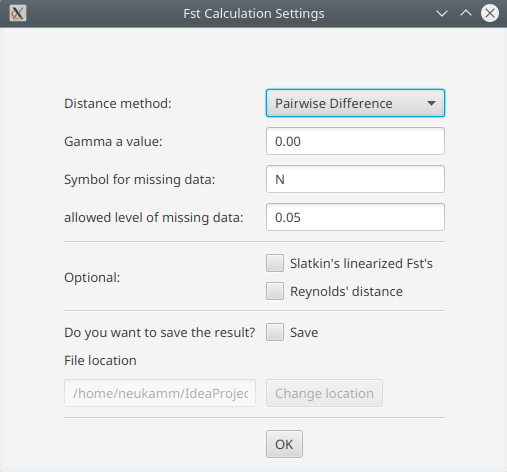

Fst value
=========

To calculate the pairwise Fst values, select *Analysis -> Calculate pairwise Fst*.
This opens a dialogue to configure the analysis.

* Distance method:
    * Pairwise difference
    * Jukes & Cantor
    * Kimura 2-parameters
* Gamma a value
    * This parameter is used to perform gamma correction on the distance measure
* Symbol for missing data
    * Specify symbol that is used for missing data in your samples
* allowed level of missing data
    * Specify allowed percentage of missing data per locus / position
* Slatkin's linearization
    * Linearize the Fst values with Slatkin's linearization (D = Fst / (1-Fst))
* Reynolds' distance
    * Linearize the Fst values with Reynolds' linearization (D = -ln(1-Fst))
* Save result
    * The result is displayed in the mitoBench and can be downloaded as txt file as well. The file location can be specified here.

Haplogroup
=========

To calculate the haplogroups, select *Analysis -> Calculate haplogroups*. This runs
HaploGrep2 in the background. The haplogroups are added as new column in the table
view and can be downloaded as hsd file as well.
