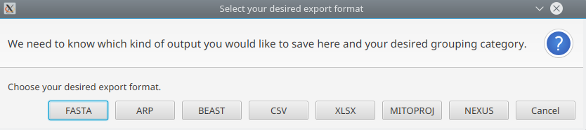

Export
======

Export data
-----------

  > File -> Export Data

To export your data, select *File -> Export Data*. This opens a export dialogue
where you can choose between different file formats:

The supported file formats are:

* MultiFastA (.fasta)
  Writes all mt sequences into a multiFastA file

* Arlequin format (.arp)

  To export your data to arp format, please specify a column that should be used
  for grouping. This output file can be used as input file for your analyses
  with Arlequin.

* BEAST format (.beast)

  This output file can be used as input file for your analyses with BEAST. The C14
  dating will be added to the header line. If your data does not have a C14 dating,
  the header of the FastA entry will only contain the sample name.

* Generic format (.csv)

  Creates a csv file containing all data displayed in the table.

* Excel format (.xlsx)

  Writes all data as Excel file.

* Nexus format (.nex)

  Writes all data into NEXUS format. This requires aligned sequences. mitoBench only
  tests whether all sequences have the same length. It's in the user's responsibility to make
  sure that the sequences are aligned.

* Mitoproject format (.mitoproj)

  Writes all (eventually filtered) data plus grouping information into a text file.
  This file can later be used to restore the current session.

* File conversions via PGDSpider

  For more advanced file conversions, PGDSpider can be run directly from mitoBench
  via *File -> Convert files with PGDSpider*. However, mitoBench does not support
  any file preparing to ease the usage of PGDSpider.

Export images
-------------

  > File -> Export chart

Each image can be exported individually, either by right-clicking on the chart, which
will open a 'Save as png' context menu, or via the File menu (select *File -> Export chart*).
This will save the currently displayed visualization as png with a good resolution.

.. note::
   The chart will be saved with the same aspect ratio displayed in the mitoBench.

Export statistics
-----------------

  > File -> Export statistics

To export calculated statistics, select *File -> Export statistics*. This will write
the currently displayed statistics to a comma separated file.
