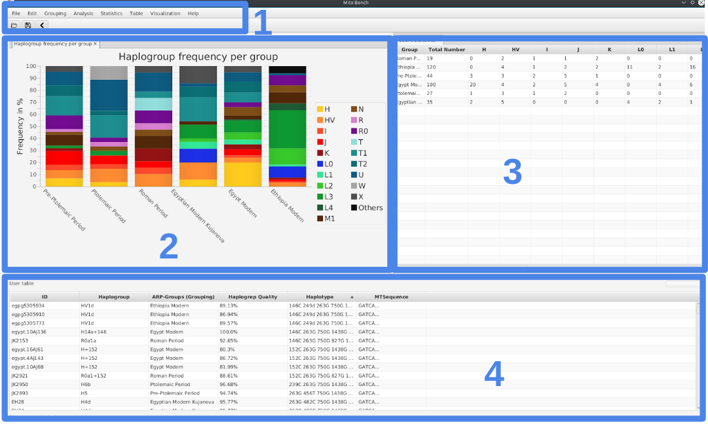

General Usage
=============

mitoBench can be used to upload and convert files and to manipulate, analyze and visualize mitochondrial data. It can
can be used in offline mode, but some functions (such as map view and DB import) require a working Internet connection.

The main window is divided into three parts. The upper part contains a toolbar (1), on the left a visualization field (2),
and a statistic/analysis area (3) on the right side. The following part shows the samples in a table format (4).

Log file
--------

By closing mitoBench, you will be asked if you want to save a log file. This file contains all steps that were done
during your analysis with mitoBench, which helps you to reconstruct your analysis at a later date.

