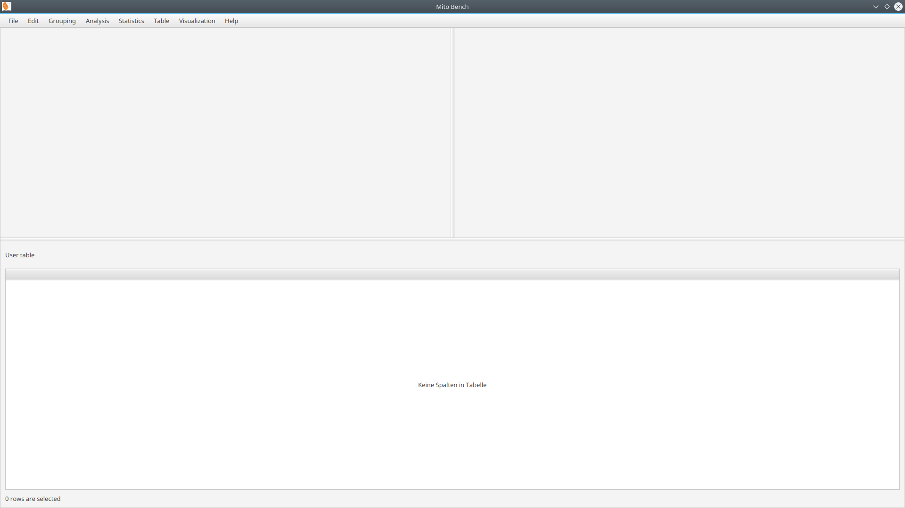

General Usage
=============

The mitoBench can be used to upload and convert files and to manipulate, analyse and
visualize mitochondrial data.

The main window is splitted into three parts. The upper part contains a visualization
panel on the left and a statistics/analysis pane on the right side. The part below
represents the samples in a table format. After logging in to the database, this
part will include the database view as well.

mitoBench can be used in offline mode. However, some functionalities (such
as the map view) require a working internet connection.

Log file
--------

By closing mitoBench, you will be aked if you want to save a log file.
This file contains all steps that were done during your analsis with mitoBench,
which helps you to reconstruct your analysis at a later date.
