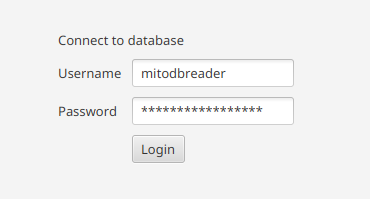
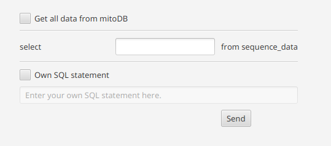

Data Import
==========

mitoBench provides different ways to import data.

Import via data upload
----------------------

mitoBench supports different file formats:

* Multi-FastA (.fasta, .fa, .fas)
* Arlequin (.arp)
* Haplogrep (.hsd)
* Excel (.xls)
* Generic file (.tsv)

  To upload a generic file, the file must have a specific format:
  * The first line starts with *##* and contains the column names separated with tabs.

    ##<colname1>  <colname2>  ....

  * The second line starts with *#* and specifies the data type of the column.
    You can find a list of all possible data types in the section below.

    #<data type1> <data type1>  ...

  * Third line to end:

    Contains the actual data. One line per sample, tab separated.

* MitoProject (.mitoproj)

The uploaded data are represented in table format. Information that are in different files,
but belonging to one sample are merged into one row based on the sample name.

.. note::
   To merge information from different files, make sure that the samples have
   identical names.

**Data types**

* String
* Categorical
  The same as data type *String* yet
* Location
  The location is expected as latitude and longitude, separated with comma.
  .. note::
     The decimal point has to be a point (*.*), no comma!

  Example: 29.2505576,18.0843603
* C14
  The C14 dating information has to have the folloring format:
  * *cal* or *CAL* can be contained, but are not required
  * *AD* / *ad* or *BC* / *bc* are followed by an integer (number)
  * Both *AD* / *ad* and *BC* / *bc* can be contained in the C14 data type.

  Example: cal AD 81-132 , AD 81-132, cal BC 37-cal AD 48

  .. note::
     The C14 dating is represented as an average value in the data table.

Import from mitoDB
------------------

To import data from mitoDB, select *File -> Import Data from DB*. This opens a
tab in the main view where you have to enter your mitoDB login data.

After login sucessfully, the user can set up a database query to specify which
data has to be loaded. More advanced user also can write their own query (SQL statement).

The secified data will be loaded to the mitoBench in a separate table and can be added
to the main user table.
