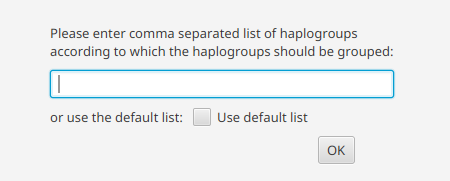

Statistics
==========

Haplogroup counts
----------------

> *Statistics -> Count haplogroups*

This counts the Haplogroups per group or of the entire dataset, if no grouping is defined.
The main groups (macro haplogroups) to which the haplogroups in the table should be
grouped to can be specified as a comma separated list.

It is also possible to use a predefined list with all macro haplogroups, defined by
PhyloTree.

 

The result is represented as table format and can be downloaded via *File -> Export statistics*.

Haplotype frequency
-------------------

> *Statistics -> Calculate haplotype frequency*

This calculates the occurrences and freuqency of each haplotype based on the current version
of PhyloTree. The result also contains the haplogroup assigned to the haplotype.
