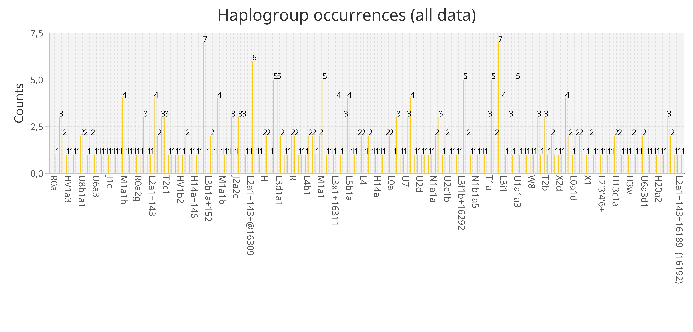
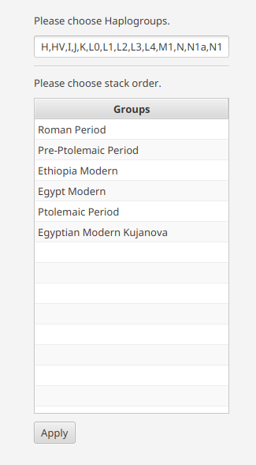
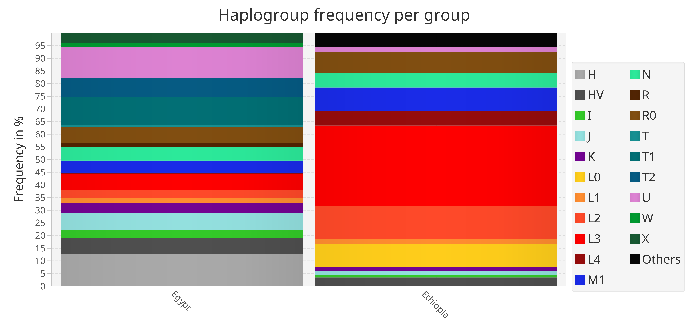
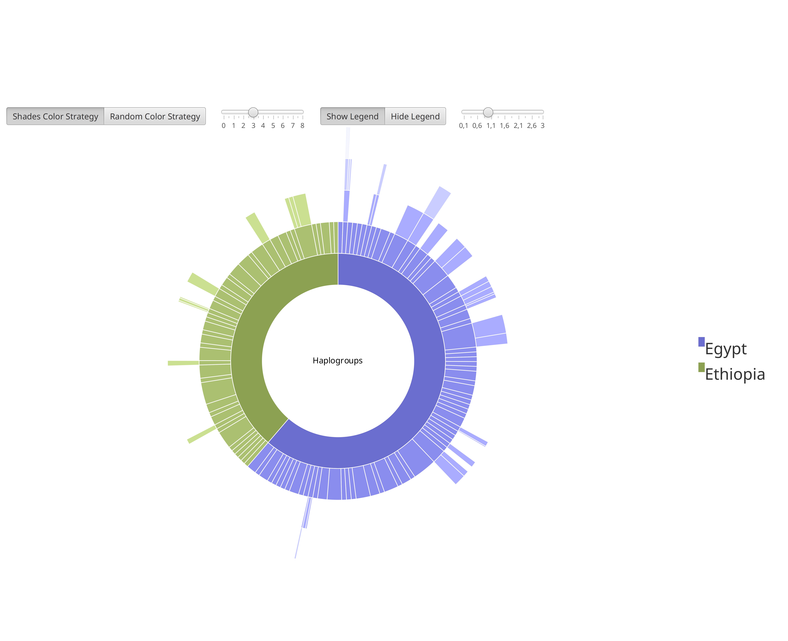
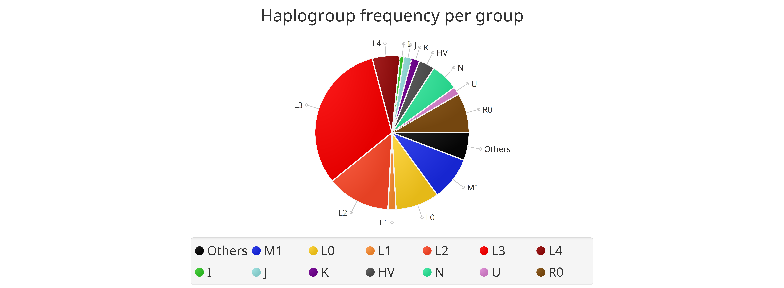
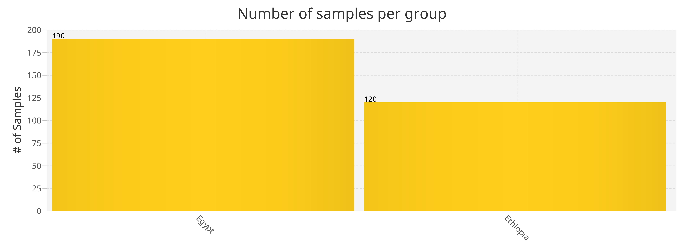

Visualizations
==============

mitoBench provides different kind of visualizations for the Haplogroup distribution
within the data set and the group sizes, if data are grouped.

Bar plot
---------

..note::
  No grouping needed.

A general visualization of the haplogroup occurrences in the whole data set is
the barplot (select *Visualization -> Haplogroups -> Create Barchart -> Plot Haplogroup frequency*) .

Stacked Bar plot
----------------

..note::
  Grouping needed.

The stacked bar plot visualizes the haplogroup frequency per group. Select
*Visualization -> Haplogroups -> Create Barchart -> Plot Haplogroup frequency per group*
to create this plot. The order of the stacks can be defined by drag-and-drop the
groups in the desired order, e.g. a chronological order.

The stacks, which represents the groups, are placed next to each other. This offers
the direct comparison of the haplogroup frequency between the different groups.

Sunburst chart
--------------

..note::
  Grouping needed.

The sunburst chart (select *Visualization -> Haplogroups -> Create Sunburst chart*)
is a circular representation of the haplogroups occuring in each
group. The different levels correspond to the levels in PhyloTree. The visualization
can be expanded by clicking on the circle unit coming directly after the most inner
circle. Clicking on the most inner cicle navigates one level back.

Profile plot
------------

..note::
  Grouping needed.

The profile plot visualizes the heplogroup profile per group. The x-axis represents
the haplogroups, the y-axis the frequency. This ease the comparison of the frequency
of one HG in different groups.

In addition, the represented data are given in table format right of the visualization panel.
Hovering over the rows hilights the corresponding line the the profile plot.

The tabs that belongs together are marked with the same number.

.. image:: images/profileplot.png
   :align: center

Pie chart
----------

..note::
  No Grouping needed.

Selecting *Visualization -> Haplogroups -> Create Pie Chart* creates a pie chart
of the haplogroups distribution. This plot can be done on groupes as well as
ungroup data.

Creates

Grouping bar plot
-----------------

..note::
  Grouping needed.

  The grouping bar plot visualizes the sizes of the different groups.
  Select *Visualization -> Grouping -> Grouping bar chart*.

