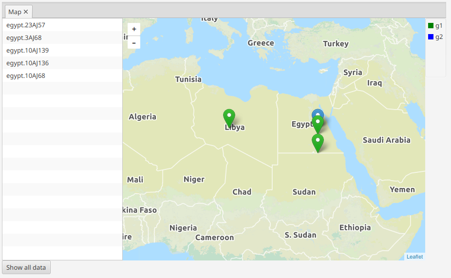

Visualizations
==============

mitoBench provides different kind of visualizations for the Haplogroup distribution
within the data set and the group sizes, if data are grouped.

Bar plot
---------

.. note::
  No grouping needed.

  > Visualization -> Haplogroups -> Create Barchart -> Plot Haplogroup frequency

A general visualization of the Haplogroup occurrences in the whole data set is
the barplot.

.. image:: images/barplothg.png
   :align: center

Stacked Bar plot
----------------

.. note::
  Grouping needed.

  > Visualization -> Haplogroups -> Create Barchart -> Plot Haplogroup frequency per group

The stacked bar plot visualizes the Haplogroup frequency per group.
The order of the stacks can be defined by drag-and-dropping the groups in the desired
order, e.g. chronological order.

.. image:: images/stackorder.png
   :align: center

The stacks, which represents the groups, are placed next to each other. This offers
the direct comparison of the Haplogroup frequency between the different groups.

.. image:: images/barplotstacked.png
   :align: center

Sunburst chart
--------------

.. note::
  Grouping needed.

  > Visualization -> Haplogroups -> Create Sunburst chart

The sunburst chart is a circular representation of the Haplogroups occuring in each
group. The different levels correspond to the levels in PhyloTree. The visualization
can be expanded by clicking on the circle unit coming directly after the most inner
circle. Clicking on the most inner cicle navigates one level back.

.. image:: images/sunburstchart.png
   :align: center

Profile plot
------------

.. note::
  Grouping needed.

  > Visualization -> Haplogroups -> Create Profile plot

The profile plot visualizes the heplogroup profile per group. The x-axis represents
the haplogroups, the y-axis the frequency. This ease the comparison of the frequency
of one HG in different groups.

In addition, the represented data are given in table format right of the visualization panel.
Hovering over the rows hilights the corresponding line the the profile plot.

The tabs that belongs together are marked with the same number.

.. image:: images/profileplot.png
   :align: center

Pie chart
----------

.. note::
  No Grouping needed.

> Visualization -> Haplogroups -> Create Pie Chart

The Haplogroup distribution can also be visualized as pie chart. This plot can be
done on groupes as well as ungroup data. In case of multiple groups, one pie chart
per goups will be created.

Creates

.. image:: images/piechart.png
   :align: center

Grouping bar plot
-----------------

> Visualization -> Grouping -> Grouping bar chart

.. note::
  Grouping needed.

  The grouping bar plot visualizes the sizes of the different groups.

.. image:: images/barplotgrouping.png
   :align: center

Map view
--------

> Visualization -> Map view -> Visualize data on map

.. note::
  No Grouping needed.

If the samples have some geographic information, they can be visualized on a map.
To add all samples to the map, click on the *Add data* button.
In case of grouped data, the grouing is represeneted as different colours, but only
up to 8 different colors are supported by now.

