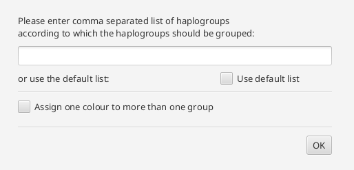
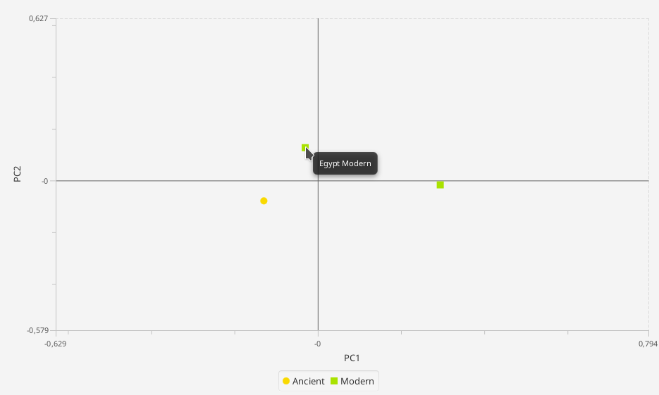

Analyses
=========

Project-based Haplogroup list
----------------------

  > Analysis -> Define Haplogroup List

This allows the user to specify a list of Haplogroups for a project. The list will be applied whenever the user is asked
for, i.e. some visualization methods, Haplogroup counting and PCA analysis. This list is also stored in the mito-project
file and automatically loaded when opening the project file again.

Pairwise Fst values (not yet publicly available, still in testing)
-------------------

  > Analysis -> Calculate pairwise Fst

.. note::
This implementation is just a prototype. The results might be incorrect.

This calculates the pairwise Fst values based on the approach of Hudson et al.
Advanced settings are provided by the configuration dialogue.

.. image:: images/Fst_settings.png
    :align: center

* Distance method:
    * Pairwise difference
    * Jukes & Cantor
    * Kimura 2-parameters

* Gamma a value
    * This parameter is used to perform gamma correction on the distance measure. The gamma a has no effect on the distance method 'pairwise difference'

* Symbol for missing data
    * Specify symbol that is used for missing data in your samples.

* allowed level of missing data
    * Specify allowed the percentage of missing data per locus/position. Loci with a value higher than the threshold are excluded from all analyses.

* Slatkin's linearization (Slatkin 1995)
    * Linearize the Fst values with Slatkin's linearization (D = Fst / (1-Fst))

* Reynolds' distance (Reynolds et al. 1983)
    * Linearize the Fst values with Reynolds' linearization (D = -ln(1-Fst))

* Number of permutations
    * The null hypothesis is the assumption that there is no difference between the population. Through permuting haplotypes between pairs of populations, a p-value is calculated to get the significance of the test. The number of permutations can be set by the user, 0 permutations mean that no test will be performed. The p-value is defined as the ratio between the number of permutations that lead to a Fst value higher or equal than the observed one and the total number of calculated p-values.

* Significance level
    * Significance level for p-value

* Save result
    * The result is displayed in the mitoBench and can be downloaded as text file as well.
    The file location can be specified here.

Finally, the result is displayed a text format and the Fst values are
visualized as a heatmap.

Haplogroups (not yet publicly available, still in developing)
-----------

  > Analysis -> Calculate haplogroups

The Haplogroups are determined by HaploGrep2 based on the FastA sequence. This
functionality is just provided in the beta version of Haplogrep2.

The calculated haplogroups are added as new column in the table view and can be
downloaded as hsd file as well.

PCA (still in testing)
----

  > Analysis -> PCA analysis

.. warning::
    This functionality has to be tested in detail. Please let us know, if you get unexpected or obviously incorrect results.

The principal component analysis requires a grouping of the data and the haplogroups. A basic grouping of the data has to be done
previously. The Haplogroups can be set in the configuration pane.
The coloring can either be set like the groups (each group gets one color)

or several groups can be assigned to one color. In the text field, the user can specify a name. The color is chosen by the tool.

.. image:: images/pcaConfig2.png
    :align: center

The result will be shown as a 2-dimensional plot in the visualization pane, and the counts used for the calculation in the
statistics pane. Hovering over the data point opens gives information about the represented group.

