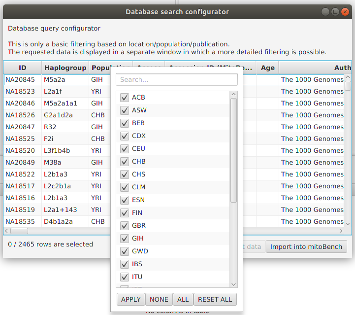
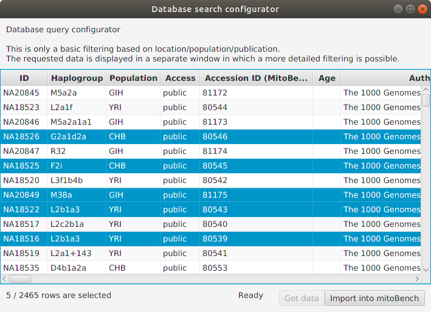

##################
Data Import
##################

mitoBench offers different ways to import data. The imported information is represented in table format. If e.g. samples
have been imported from different files, they are merged into one row based on the column *accession id*.

.. note::
   To merge information from different files, make sure that the samples have identical accession ids!

***********************
Import via data upload
***********************

mitoBench supports different file formats:

* Multi-FastA (.fasta, .fa, .fas, .fna)

  mitoBench supports the upload of fasta and multifasta files. The header of each entry will be set as accession ID without
  a version information, which is the case e.g. for GenBank entries.

   Example:

   *KJ154949.1 Homo sapiens isolate Y5728 mitochondrion, complete genome* will be shortened to *KJ154949* and set as accession id.

* Arlequin (.arp)

   Files that were used for analyses in Arlequin can be imported to mitoBench as well. The grouping will be set as a new column.

* Haplogrep (.hsd)

   The hsd file must be tab-separated. Files separated by comma or space cannot be read. HaploGrep2 automatically creates tab-delimited files.

* Excel (.xls, .xlsx)

  * The file needs to have the same format for the first two rows as the generic file. First row will be used as header
    and has to start with ##, the second row must contain the data types (starting with #).

* Generic file (.tsv, .csv)

  To upload a generic file, the file must have a specific format:

  * The first line starts with *##* and contains the column names separated with tabs/commas.

    ##<colname1>\\\t<colname2>\\\t....

    ##<colname1>,<colname2>,....

  * The second line starts with *#* and specifies the data type of the column.
    You can find a list of all possible data types in the section below.

    #<data type1>\\\t<data type1>\\\t...

    #<data type1>,<data type1>,...

  * Third line to end:

    Contains the actual data. One line per sample, tab-/comma-separated.

    Example:

    .. code-block:: bash

        ##ID    C14-Date    Sample Country
        #String    C14 String
        JK2916    cal BC 1111-998 Eygpt
        JK2895    cal AD 25-111   Eygpt
        JK2907    cal AD 26-84    Eygpt
        JK2907    cal AD 26-84    Eygpt

* MitoProject (.mitoproj)

    This file contains all information about a previous project, like grouping, filtering, and project-specific haplogroup list.
    Only one project can be imported per session.

**Data types**

* String
* Categorical

  The same as data type *String* yet

* Location

  The location is expected as latitude and longitude. Each value has a separate column.

  .. warning::
   The decimal point has to be a point (*.*), no comma!

* C14

  *We are working on this at the moment.*

.. note::
   All files can also be imported into mitoBench via drag & drop.

.. _databaseaccess-label:

******************
Import from mitoDB
******************

To import data from mitoDB, select *File --> Import Data from DB*. This opens the database search configurator, where
you can do a initial filtering of the data.

.. image::   images/mitobench_search.png
  :align: center

Currently, three different filter modes are supported. This is an either-or filtering, so the different options cannot
be combined, (which is planned in the future).

* Getting all data

  Returns all data that are contained in the database. Depending on the internet connection, this can take some minutes.

* Getting only data from 1000 Genome Project (phase 3)

  Returns 2,504 sequences from the 1000 GP Phase 3.

* Filtering data by sample location, publication, or population.

After a successfully getting the data (clicking on 'Get Data'), they will displayed in this window. Now, a more detailed
filtering is possible by right-clicking on the corresponding column. This will open a list with all entries contained in
the data selection and allows to select and deselect certain values.

It is also possible to select rows and add only the selection to the workbench.

After clicking the 'Import into mitoBench' button, the data can further be explored in the workbench.
