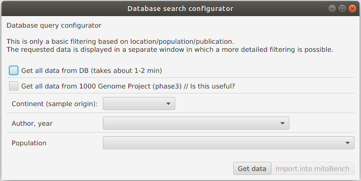

##################
Data Import
##################

mitoBench offers different ways to import data.

***********************
Import via data upload
***********************
::

    File -> Import

mitoBench supports different file formats:

* Multi-FastA (.fasta, .fa, .fas)

  To upload fastA files, please align them before with an aligner of your choice.

* Arlequin (.arp)
* Haplogrep (.hsd)

  The HDS file has to be tab separated. Comma or space - separated files cannot be read. HaploGrep2 automatically creates tab-separated files.
* Excel (.xls)

  * First row will be used as header

* Generic file (.tsv)

  To upload a generic file, the file must have a specific format:

  * The first line starts with *##* and contains the column names separated with tabs.

    ##<colname1>\\\t<colname2>\\\t....

  * The second line starts with *#* and specifies the data type of the column.
    You can find a list of all possible data types in the section below.

    #<data type1>\\\t<data type1>\\\t...

  * Third line to end:

    Contains the actual data. One line per sample, tab separated.

Example:

.. code-block:: bash

    ##ID    C14-Date    Sample Location
    #String    C14 String
    JK2916    cal BC 1111-998 Eygpt
    JK2895    cal AD 25-111   Eygpt
    JK2907    cal AD 26-84    Eygpt
    JK2907    cal AD 26-84    Eygpt

* MitoProject (.mitoproj)
    This file contains all information about a previous project, like grouping, filtering and haplogroup list.
    Only one project can be imported per session.

The imported information is represented in table format. If e.g. samples have been imported from different files, they are merged into one row based on the sample name.

.. note::
   To merge information from different files, make sure that the samples have
   identical names/identifiers!

**Data types**

* String
* Categorical

  The same as data type *String* yet

* Location

  The location is expected as latitude and longitude, separated with a comma.

 Example: 29.2505576,18.0843603

  .. note::
   The decimal point has to be a point (*.*), no comma!

* C14

  The C14 dating information requires one of the following formats:

  * *cal* or *CAL* can be contained, but are not required

  * *AD* / *ad* or *BC* / *bc* are followed by an integer (number)

  * Both *AD* / *ad* and *BC* / *bc* can be contained in the C14 data type

  Example: cal AD 81-132 , AD 81-132, cal BC 37-cal AD 48

  .. note::
   The C14 dating is represented as an average value in the data table, as well as the lower and upper value, if available.

*************************
Import via Drag and Drop
*************************

All files mentioned in the section above can also be added by drag and drop files into the table view of the mitoBench.

******************
Import from mitoDB
******************

::

    File -> Import Data from DB

To import data from mitoDB, select *File -> Import Data from DB*. This opens the database search configurator, where
you can do a initial filtering of the data.

After a successfully getting the data (clicking on 'Get Data'), they will displayed in this window. Now, a more detailed filtering is possible by right-clicking on the
corresponding column. This will open a list with all entries contained in the data selection and allows to select and deselect
certain values.

After clicking the 'Import into mitoBench' button, the data can further be explored in the workbench.
