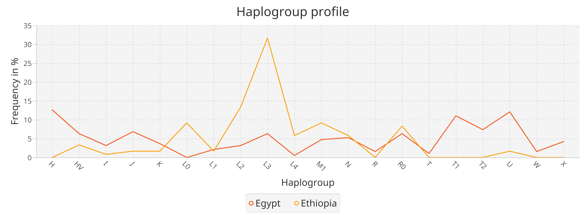

Visualizations
==============

mitoBench provides a variety of different visualizations for the Haplogroup distribution
within a data set. 

Bar plot
---------

  > Visualization -> Haplogroups -> Create Barchart -> Plot Haplogroup frequency

A general visualization of the Haplogroup occurrences in the whole dataset visualized using a simple barplot.

.. image::   images/barplothg.png
    :align: center

Stacked Barplot
----------------

  > Visualization -> Haplogroups -> Create Barchart -> Plot Haplogroup frequency per group

The stacked bar plot visualizes the Haplogroup frequency per group.
The order of the stacks can be defined by drag-and-dropping the groups in the desired
order, e.g. chronological order.

.. image::   images/stackorder.png
    :align: center

The stacks, which represent the groups, are placed next to each other. This offers
a direct comparison of the Haplogroup frequency between the different groups.

.. image::   images/barplotstacked.png
    :align: center

Profile plot
------------

  > Visualization -> Haplogroups -> Create Profile plot

The profile plot can visualize the haplogroup profile per group. The x-axis represents
the haplogroups, the y-axis the frequency. This enables the comparison of the frequency
of one HG in different groups.

In addition, the represented data is provided in a table format next to the visualization panel.
Hovering over the rows highlights the corresponding line in the profile plot.

Tabs relying on each other are marked with the same automatically increasing number.

Pie chart
----------

  > Visualization -> Haplogroups -> Create Pie Chart

The Haplogroup distribution can also be visualized as a pie chart. This plot can be
done on groups and ungrouped data. In case of multiple groups, one pie chart
per group is created.

.. image::   images/piechart.png
    :align: center

Grouping bar plot
-----------------

  > Visualization -> Grouping -> Grouping bar chart

The grouping bar plot visualizes the sizes of the different groups.

.. image::   images/barplotgrouping.png
    :align: center

Map view
--------

  > Visualization -> Map view -> Visualize data on map

If the samples have some geographic information, they can be visualized on a map.
To add all samples to the map, click on the *Add data* button.
In case of grouped data, the grouping is represented with different colors, but only
up to 8 different colors are supported by now.

.. image::   images/mapview.png
    :align: center
