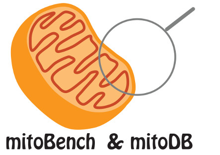

.. mitoBench documentation master file, created by
   sphinx-quickstart on Thu Jun 29 11:02:05 2017.
   You can adapt this file completely to your liking, but it should at least
   contain the root `toctree` directive.

Welcome to mitoBench's documentation!
=====================================

   
This is the main mitoBench documentation, where you can find information about the prerequisites, the installation, and the usage of this workbench.

.. toctree::
   :maxdepth: 2
   
   contents/prerequisites

   contents/installation

   contents/generalUsage

   contents/workbench/workbench

   contents/database/database

   contents/citations

.. mitoBench contents/import
   contents/export
   contents/fileconversion
   contents/grouping
   contents/filtering
   contents/tableOption
   contents/analysis
   contents/statistics
   contents/visualization

.. contents/mitoDB
   contents/TemplateGenerator
   contents/glossary

Indices and tables
==================

* :ref:`genindex`
* :ref:`modindex`
* :ref:`search`
